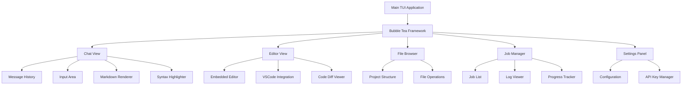

# TUI Implementation Plan for CLI Agent

## Overview
Transform the current simple REPL into a modern, interactive Terminal UI (TUI) using Bubble Tea, matching the capabilities of Claude Code Here.

## Architecture

## Core Features

### 1. TUI Framework Setup
- **Library**: github.com/charmbracelet/bubbletea
- **Dependencies**: lipgloss (styling), bubbletea (state management), tea (effects)
- **Structure**: Main app model with sub-models for each view

### 2. Chat Interface
- Message history with timestamps and roles
- Input field with auto-complete and suggestions
- Markdown rendering for responses
- Syntax highlighting for code blocks
- Message threading and context management

### 3. Code Editor Integration
- Embedded editor using github.com/rivo/tview or similar
- File selection and tree navigation
- Code diff viewer
- VSCode integration via CLI commands
- Go-to-definition and code exploration

### 4. Project Explorer
- Tree view of current directory
- File operations (open, edit, delete, rename)
- Git integration (status, diff, commit)
- Project structure visualization

### 5. Job Manager
- Background job tracking with real-time updates
- Log streaming and tailing
- Progress bars and status indicators
- Job dependencies and pipelines

### 6. Settings & Configuration
- API key management (secure storage)
- Model selection and configuration
- Prompt templates and customization
- Theme and appearance settings

## Implementation Steps

### Phase 1: Foundation (TUI Framework)
1. Add Bubble Tea and related dependencies to go.mod
2. Create main TUI application structure
3. Implement basic app model and view
4. Add key bindings and navigation

### Phase 2: Chat Interface
1. Implement message history component
2. Add input field with validation
3. Integrate markdown renderer
4. Add syntax highlighting for code
5. Implement message animations and transitions

### Phase 3: Code Editor
1. Create embedded file explorer
2. Add file operations (open, save, delete)
3. Implement code diff viewer
4. Add VSCode integration commands

### Phase 4: Job Management
1. Create job list component
2. Implement log streaming
3. Add progress tracking
4. Create job control interface

### Phase 5: Settings & Configuration
1. Create settings panel UI
2. Implement API key management
3. Add theme customization
4. Add configuration file editing

## Technology Stack

### New Dependencies to Add
- `github.com/charmbracelet/bubbletea`: TUI framework
- `github.com/charmbracelet/lipgloss`: Terminal styling
- `github.com/charmbracelet/bubbles`: UI components
- `github.com/alecthomas/chroma`: Syntax highlighting
- `github.com/yuin/goldmark`: Markdown parsing
- `github.com/rivo/tview`: Terminal UI widgets (for editor)

### Existing Dependencies (Reused)
- Minimax API integration
- Job management system
- Configuration system
- Command execution

## UI/UX Design Principles

### Visual Design
- Clean, modern interface
- Clear visual hierarchy
- Consistent spacing and typography
- Responsive layout
- Support for dark/light themes

### Interactions
- Intuitive key bindings
- Smooth transitions
- Real-time updates
- Help system
- Error handling and feedback

### Performance
- Efficient rendering
- Lazy loading
- Background processing
- Responsive to user input

## Milestones

1. **Week 1**: Basic TUI framework and chat interface
2. **Week 2**: Code editor and file explorer
3. **Week 3**: Job management and project explorer
4. **Week 4**: Settings, configuration, and final polish

## Testing Strategy

1. Unit tests for TUI components
2. Integration tests for AI interactions
3. User acceptance testing with real scenarios
4. Performance testing under load
